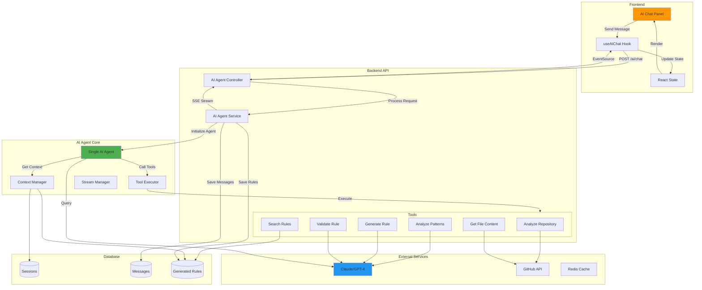
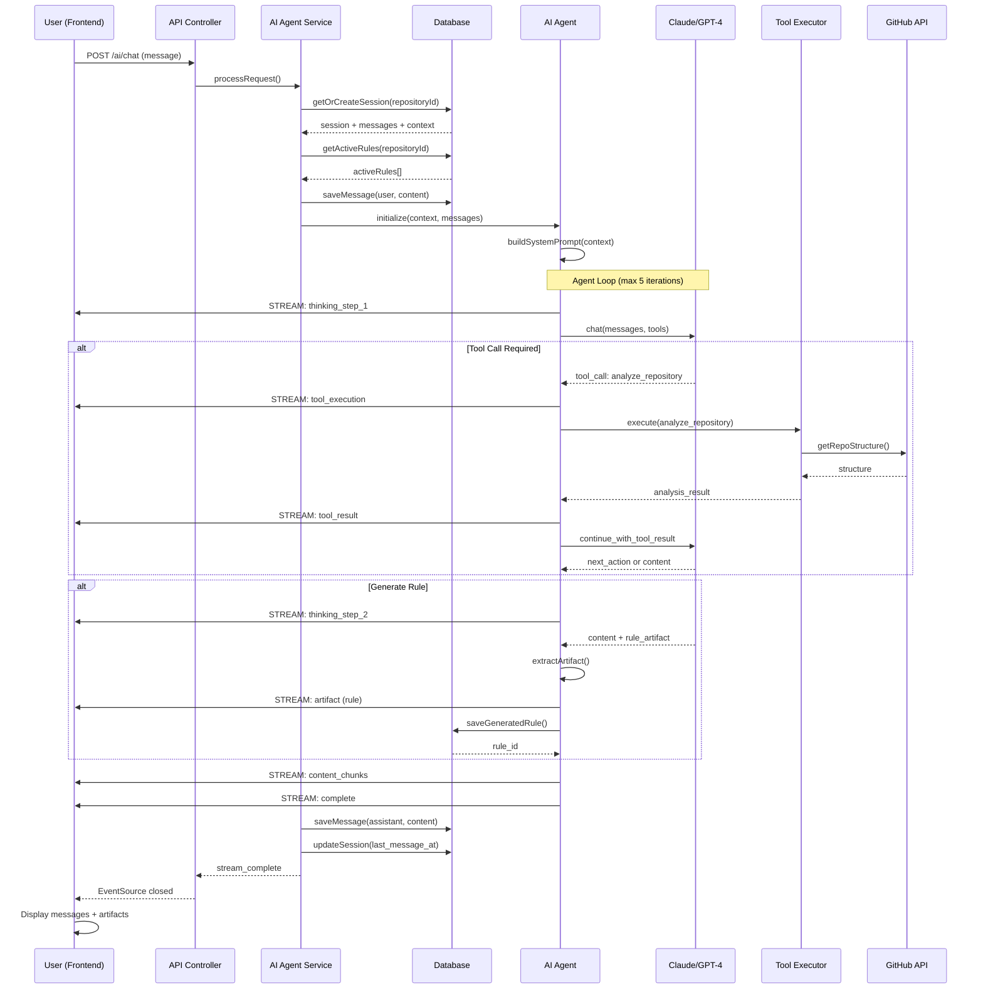
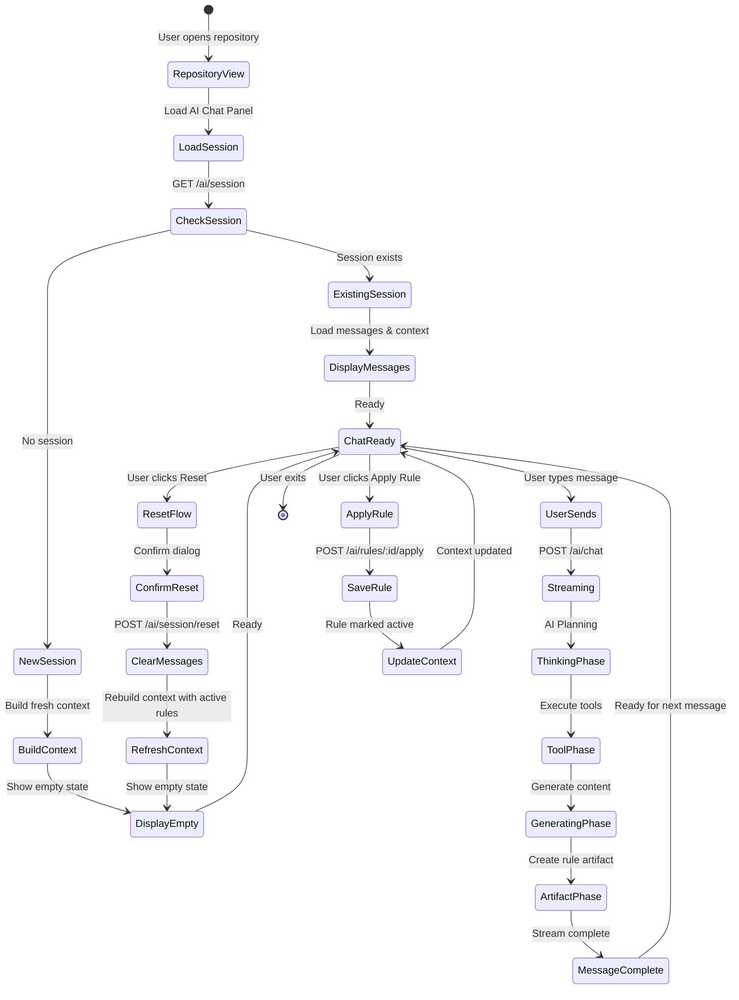
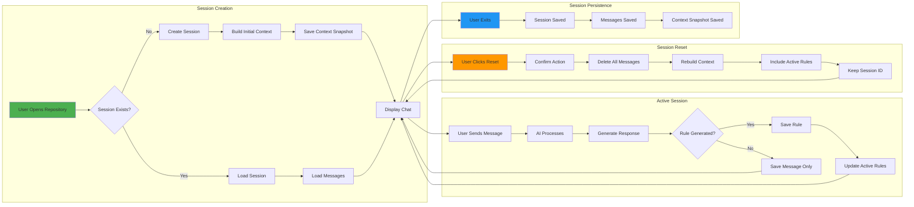
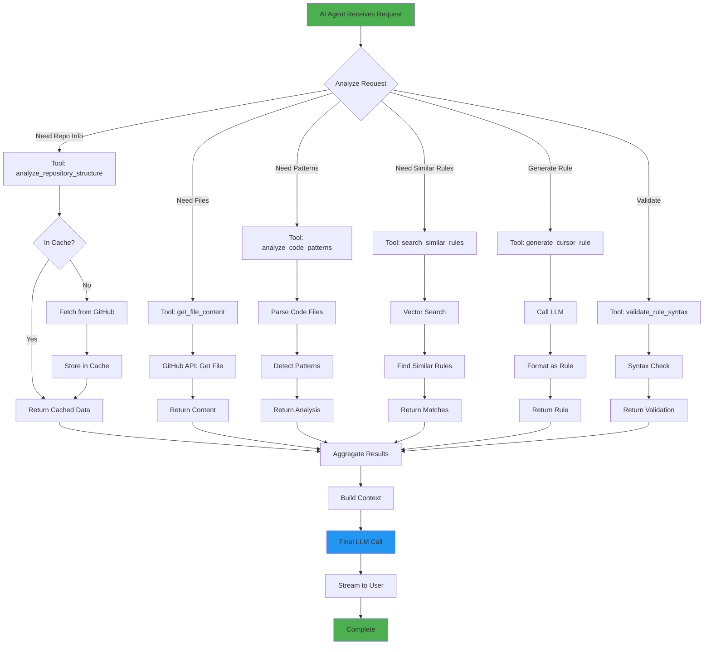
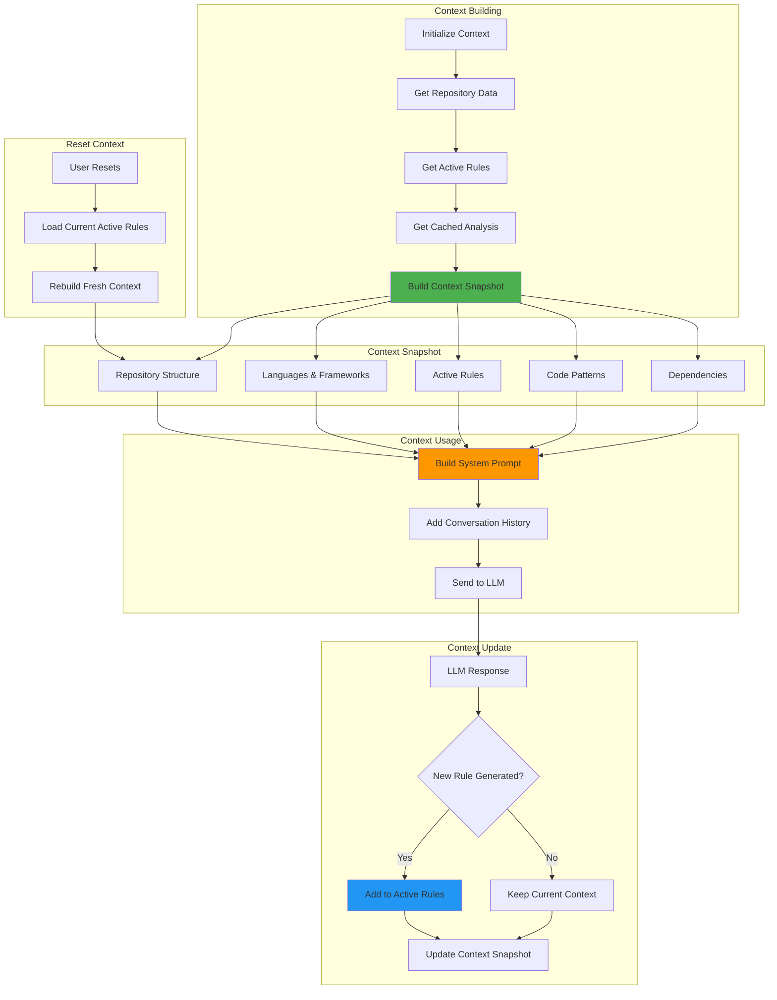
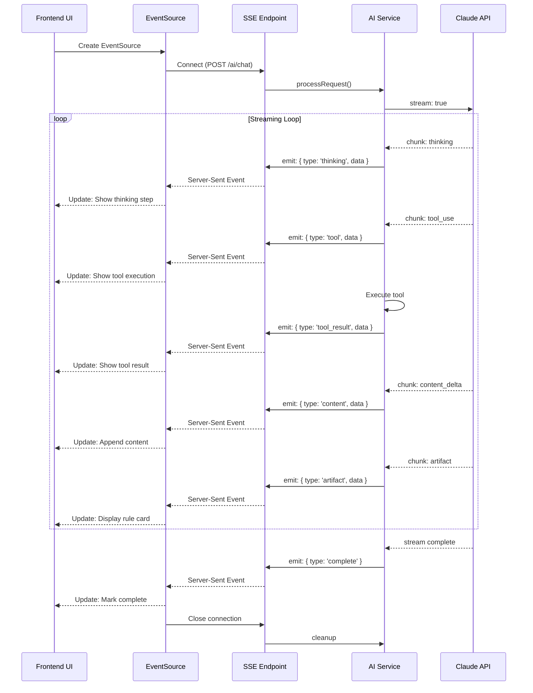
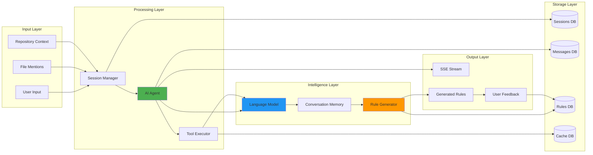

# AI Agent Architecture & Database Design

## 1. Database Schema - Entity Relationship Diagram

```mermaid
erDiagram
    %% NOTE: No users table - Clerk is the source of truth
    %% All user_id fields are TEXT containing Clerk user IDs from JWT (auth.jwt()->>'sub')
    %%
    %% UNIQUE CONSTRAINTS (not shown in diagram):
    %% - git_integrations: UNIQUE(user_id, provider)
    %% - repositories: UNIQUE(workspace_id, provider_repo_id)
    %% - user_ai_preferences: PRIMARY KEY(user_id)

    workspaces ||--o{ workspace_members : "has"
    workspaces ||--o{ repositories : "contains"
    workspaces ||--o{ repository_ai_sessions : "has"
    workspaces ||--o{ cursor_rules : "has"
    workspaces ||--o{ ai_usage_statistics : "tracks usage"

    git_integrations ||--o{ repositories : "connects"

    repositories ||--o| repository_ai_sessions : "has one active"
    repositories ||--o{ cursor_rules : "has many"
    repositories ||--o{ workspace_rule_snapshots : "has snapshots"
    repositories ||--o{ ai_usage_statistics : "tracks usage"

    repository_ai_sessions ||--o{ ai_chat_messages : "contains"
    repository_ai_sessions ||--o{ ai_usage_statistics : "tracks usage"

    ai_chat_messages ||--o| cursor_rules : "generates"
    ai_chat_messages ||--o{ ai_usage_statistics : "tracks usage"

    cursor_rules ||--o| cursor_rules : "versions"
    cursor_rules ||--o{ rule_versions : "has history (optional)"

    workspace_rule_snapshots ||--o{ cursor_rules : "captures state of"

    workspaces {
        uuid id PK
        text owner_id "Clerk user ID from JWT"
        text name
        timestamptz created_at
    }

    workspace_members {
        uuid workspace_id PK,FK
        text user_id PK "Clerk user ID from JWT"
        workspace_role role
    }

    git_integrations {
        uuid id PK
        text user_id "Clerk user ID from JWT"
        git_provider provider
        text provider_user_id
        text provider_username
        text access_token
        text refresh_token
        timestamptz token_expires_at
        text[] scopes
        timestamptz created_at
        timestamptz updated_at
    }

    repositories {
        uuid id PK
        uuid workspace_id FK
        uuid git_integration_id FK
        text name
        text full_name
        text description
        text url
        git_provider provider
        text provider_repo_id
        text default_branch
        boolean is_private
        text language
        text[] topics
        int stars_count
        int forks_count
        timestamptz last_synced_at
        text sync_status
        text sync_error
        timestamptz created_at
        timestamptz updated_at
    }

    repository_ai_sessions {
        uuid id PK
        uuid repository_id FK
        text user_id "Clerk user ID from JWT"
        boolean is_active
        int message_count
        jsonb context_snapshot
        timestamptz created_at
        timestamptz updated_at
        timestamptz last_message_at
    }

    ai_chat_messages {
        uuid id PK
        uuid session_id FK
        text role
        text content
        jsonb metadata
        timestamptz created_at
    }

    cursor_rules {
        uuid id PK
        uuid repository_id FK
        text user_id "Clerk user ID from JWT"
        uuid source_message_id FK
        rule_type type
        text file_name
        text content
        boolean is_active
        int current_version
        timestamptz deleted_at "soft delete"
        timestamptz created_at
        timestamptz updated_at
    }

    rule_versions {
        uuid id PK
        uuid rule_id FK
        int version_number
        text content
        timestamptz created_at
    }

    workspace_rule_snapshots {
        uuid id PK
        uuid repository_id FK
        text user_id "Clerk user ID from JWT"
        int snapshot_number
        text description
        text change_type
        jsonb rules_snapshot "Complete state"
        timestamptz created_at
    }

    user_ai_preferences {
        text user_id PK "Clerk user ID from JWT"
        text default_provider "groq, openai, etc"
        text default_model
        numeric default_temperature
        int default_max_tokens
        bigint total_tokens_used
        bigint total_requests_count
        timestamptz last_used_at
        timestamptz created_at
        timestamptz updated_at
    }

    ai_usage_statistics {
        uuid id PK
        text user_id "Clerk user ID from JWT"
        uuid workspace_id FK
        uuid repository_id FK
        uuid session_id FK
        uuid message_id FK
        text provider "groq, openai, etc"
        text model "model name"
        int prompt_tokens
        int completion_tokens
        int total_tokens
        numeric estimated_cost "in USD"
        int generation_time_ms
        timestamptz created_at
    }
```

## 2. AI Agent Architecture - High Level Overview



## 3. AI Agent Processing Flow - Detailed



## 5. User Interaction Flow



## 5. Session Lifecycle Management



## 6. Tool Execution Pipeline



## 7. Context Management Flow



## 8. Streaming Architecture



## 9. Data Flow Summary



## Key Design Principles

### 1. **Single Session Per Repository**

- One active conversation per repository per user
- Simplifies state management
- Easy to load and resume
- Clear reset functionality

### 2. **Context Preservation**

- Active rules always included in context
- Repository structure cached
- Code patterns analyzed once
- Context snapshot saved with session

### 3. **Streaming First**

- Real-time feedback to user
- Show thinking process
- Display tool executions
- Stream rule generation

### 4. **Tool-Based Architecture**

- Modular tool system
- Each tool has single responsibility
- Easy to add new tools
- Tools can be cached

### 5. **State Management**

```
Repository → Session (1:1) → Messages (1:N) → Rules (N:N)
```

### 6. **Cache Strategy**

- Repository structure: 24 hours (via GitHub API)
- File content: 1 hour (via GitHub API)
- Similar rules: Real-time search

### 7. **Performance Optimization**

- Lazy load messages (last 20)
- Cache repository structure
- Debounce user input
- Stream responses incrementally

### 8. **Error Handling**

- Graceful tool failures
- Fallback to cached data
- User-friendly error messages
- Automatic retry logic

## Why This Database Design is Optimal for Cursor Rules

### Understanding Cursor Rules Diversity

Cursor rules come in many forms:

- **Project-level**: `.cursorrules` in project root
- **Directory-level**: Multiple `.cursorrules` in subdirectories
- **User-level**: Global user preferences
- **Different formats**: Markdown, plain text, YAML-like structures
- **Team variations**: Different teams have different conventions

### The `cursor_rules` Table Design Philosophy

#### 1. **Content Flexibility (TEXT field)**

```sql
content TEXT NOT NULL
```

**Why**: Stores ANY format of cursor rules without imposing structure

- ✅ Supports markdown, plain text, YAML, or custom formats
- ✅ No character limits (TEXT can store up to 1GB in PostgreSQL)
- ✅ Preserves exact formatting, whitespace, and special characters
- ✅ Team-specific conventions are maintained exactly as written

**Example supported formats**:

```
# Format 1: Markdown
## Project Rules
- Use TypeScript
- Follow React patterns

# Format 2: YAML-like
project:
  language: typescript
  framework: react

# Format 3: Plain instructions
You are an expert in TypeScript and React.
Always use functional components.
```

#### 2. **Type Enum for Rule Categories**

```sql
type rule_type AS ENUM (
  'PROJECT_RULE',      -- Rules shown in .cursor/rules/ (virtual tree)
  'COMMAND',           -- Commands shown in .cursor/commands/ (virtual tree)
  'USER_RULE'          -- Root .cursorrules file (downloadable)
)
```

### API Response Example

```json
// GET /api/repositories/repo-123/rules/tree

{
  "name": ".cursor",
  "type": "directory",
  "path": ".cursor",
  "children": [
    {
      "name": "rules",
      "type": "directory",
      "path": ".cursor/rules",
      "children": [
        {
          "name": "api-integration.rules.mdc",
          "type": "file",
          "path": ".cursor/rules/api-integration.rules.mdc",
          "ruleId": "rule-001",
          "metadata": {
            "file_name": "api-integration",
            "type": "PROJECT_RULE",
            "createdAt": "2025-01-15T10:00:00Z",
            "updatedAt": "2025-01-15T10:00:00Z"
          }
        },
        {
          "name": "component-structure.rules.mdc",
          "type": "file",
          "path": ".cursor/rules/component-structure.rules.mdc",
          "ruleId": "rule-002",
          "metadata": {
            "file_name": "component-structure",
            "type": "PROJECT_RULE",
            "createdAt": "2025-01-15T11:00:00Z",
            "updatedAt": "2025-01-15T11:00:00Z"
          }
        }
      ]
    },
    {
      "name": "commands",
      "type": "directory",
      "path": ".cursor/commands",
      "children": [
        {
          "name": "code-review.md",
          "type": "file",
          "path": ".cursor/commands/code-review.md",
          "ruleId": "rule-004",
          "metadata": {
            "file_name": "code-review",
            "type": "COMMAND",
            "createdAt": "2025-01-15T12:00:00Z",
            "updatedAt": "2025-01-15T12:00:00Z"
          }
        }
      ]
    }
  ]
}
```

### File Naming Rules (Summary)

```typescript
// ONLY 3 RULE TYPES SUPPORTED

// Filename = file_name from DB + type-specific extension
PROJECT_RULE   → {file_name}.rules.mdc   (in .cursor/rules/)
COMMAND        → {file_name}.md          (in .cursor/commands/)
USER_RULE      → .cursorrules            (root file, not in .cursor/)

// Directory structure (FLAT - no subdirectories)
.cursor/rules/                           ← PROJECT_RULE (flat)
.cursor/commands/                        ← COMMAND (flat)
.cursorrules                             ← USER_RULE (root file)

// file_name is already normalized: lowercase, hyphens, no special chars
```
